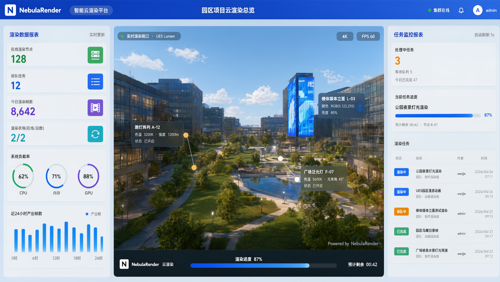
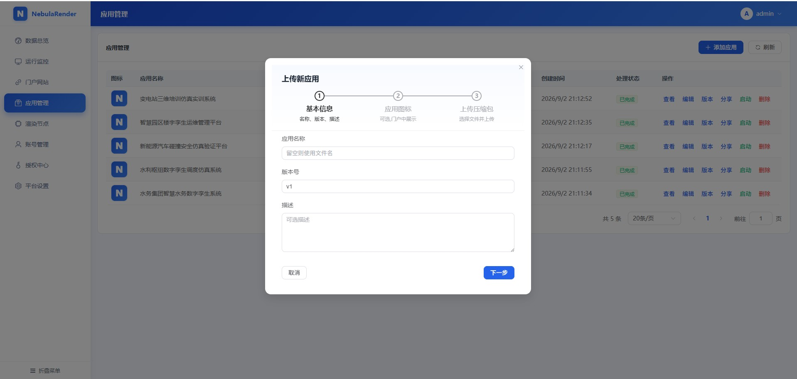
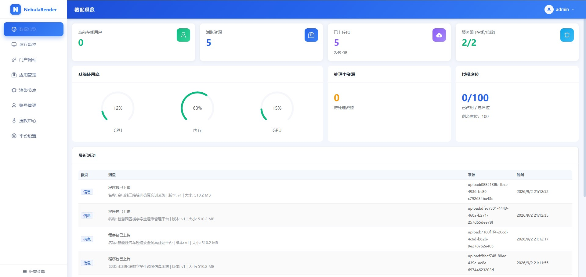
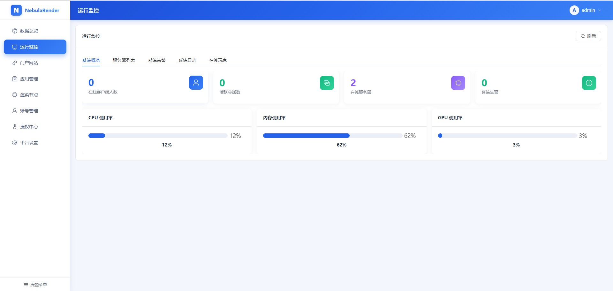
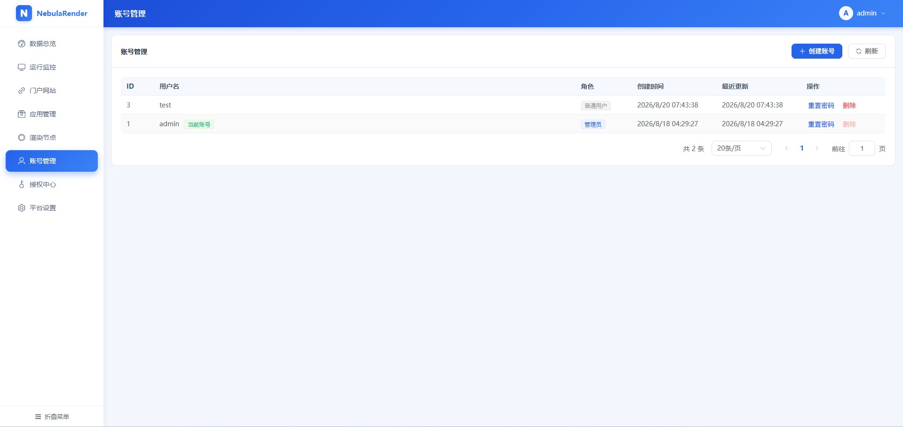
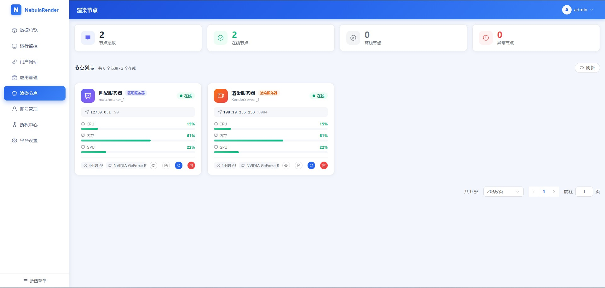

  

# NebulaRender 云渲染管理平台

> 让 UE 像素流真正落地商用：开箱即用的管理后台、应用分发、渲染集群调度与运营监控，支持私有化部署与国产化环境。

NebulaRender 是一套**基于 Unreal Engine Pixel Streaming 的云渲染运营平台**：把 UE 做好的应用上传到平台，即可一键生成链接分发给用户，用户用浏览器点开即用，无需安装任何软件。

产品以**离线包**形式私有化交付，部署在企业自己的服务器上（可完全在内网），业务数据不出本地。

## 适用场景

- 水务、电力、交通等行业的数字孪生与仿真系统
- 工业设计评审与大型设备展示
- 教学实训与医疗仿真
- 虚拟展厅与云游戏
- 信创/国产化环境下的三维应用云化

## 核心功能

### 应用管理与分享

- 应用包网页上传（大文件支持断点续传），多版本管理、一键激活与回滚
- 生成带权限的**分享链接**，发给用户即可打开云渲染应用

### 可视化管理后台

- 数据总览：在线用户、服务器状态、应用使用情况一目了然
- 应用、渲染节点、账号、平台设置全部在网页上完成，无需命令行
- 管理员 / 普通用户双角色，普通用户只能看到自己的应用

### 渲染集群调度

- 多台渲染服务器自动组网、负载均衡，用户请求自动分配到合适节点
- 节点资源不足时自动进入排队提示；节点离线自动告警
- 支持**协作模式**（多人共享同一画面，适合会议、讲解）与**独立模式**（每人独占一台实例，适合设计、仿真）

### 用户访问体验

- 浏览器即点即用，无需安装客户端
- 网络波动时自动调节清晰度，多人同时在线互不干扰
- 分享链接可对接现有账号系统（免登录直达）

### 复杂网络增强（可选）

- 跨网段、内网穿透等场景可开启中心化媒体转发，连接更稳定；不开启也不影响使用

### 国产化适配

- 支持人大金仓数据库与常见国产 GPU（含摩尔线程、景嘉微等），提供 Linux 国产硬件部署支持

### UE 全版本兼容

- 提供与 UE 5.1-5.8 各引擎版本对应的定制插件包，UE 工程接入后即可打包发布

## 与原生 UE Pixel Streaming 的对比

| 维度      | 原生 UE Pixel Streaming     | NebulaRender              |
| ------- | ------------------------- | ------------------------- |
| 开箱即用    | 不支持，需自行集成搭建后台与前端          | 离线包解压即用，自带整套后台            |
| 应用管理    | 不支持，只支持一对一访问单个应用，无法管理应用程序 | 网页上传、多版本管理、一键生成分享链接       |
| 规模化运营   | 不支持，无法多应用、多渲染服务器统一调度      | 自动调度、负载均衡、忙时排队            |
| 管理后台与权限 | 不支持，无管理后台、无账号体系           | 数据总览、双角色权限、企业单点登录         |
| 使用模式    | 只支持一对一                    | 协作模式（多人共享画面）与独立模式（每人独占实例） |
| 输入与剪贴板  | 不支持中文输入，也不支持复制粘贴          | 支持中文输入与复制粘贴               |
| 运维与国产化  | 不支持，需自行监控、部署与适配           | 后台远程运维、自动告警，国产数据库与 GPU 适配 |

## 部署形态

平台由**后台服务器**、**渲染服务器**与\*\*媒体转发（可选）\*\*三部分组成，分别交付 **Windows** 与 **Linux** 两种离线包：

- 解压即用，包内自带运行环境，无需手工安装依赖；
- 后台服务器与渲染服务器可同机部署，也可拆分到多台横向扩容；
- 支持内网离线运行，数据保留在客户服务器本地。

按 [快速开始](wiki/快速开始.md) 操作即可完成部署并跑通第一个应用。

*NebulaRender — 让 UE 像素流送真正可用、可管、可运营。*

## 使用文档

- [使用手册（Wiki 首页）](wiki/README.md)
- [快速开始](wiki/快速开始.md)
- [功能介绍](wiki/功能介绍.md)
- [部署与运维](wiki/部署与运维.md)
- [数据库与国产化](wiki/数据库与国产化.md)
- [授权与购买（授权方案）](wiki/商业授权.md)

## 联系我们

- 商务合作 / 授权咨询 / 技术支持：**<startechnology1994@163.com>**
- 企业微信：<https://work.weixin.qq.com/ca/cawcdef9a4d05fef8c>
- Bilibili 视频教程：<https://space.bilibili.com/3546688536971381>

